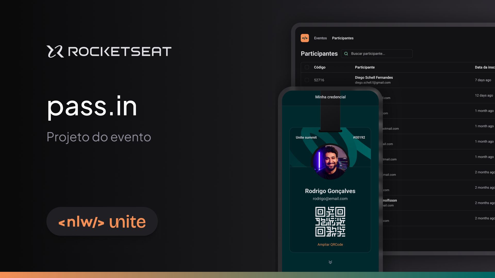

# NLW PassIn

 

> O NLW PassIn tem como objetivo o controle de check-in de participantes em eventos.

## ⚡️ Tecnologias utilizadas:

- React
- TypeScript
- Tailwind
- Dayjs (Formatação de Datas)
- Lucide React (Icons)
